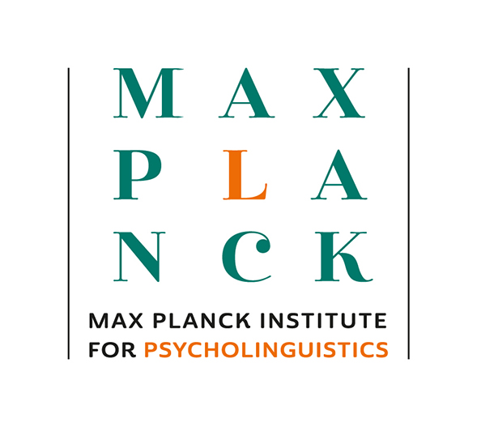

  

# Multimodal Language Department – MPI for Psycholinguistics

We study how visible bodily signals (hands, face, body posture) coordinate with speech to form multimodal language. Our work spans corpora, experimental design, computational modeling, and kinematic / gesture analysis.  
More info: [MPI Multimodal Language Department](https://www.mpi.nl/department/multimodal-language-department/23)

---

## Software for Gesture / Kinematic Analytics

Below are core software modules maintained by our department that support general motion, gesture, and kinematic analyses. Each repository is designed to be installable and runnable on its own.

| Module | Purpose | Repository |
|---|---|---|
| Smoothing | Temporal filtering / smoothing of raw motion time series | `gesture-smoothing` |
| Normalization | Scaling, alignment, normalization across participants / sessions | `gesture-normalization` |
| Merge ELAN + MediaPipe | Merge synchronization of ELAN annotations with pose/face/hands data | `gesture-merge` |
| Kinematics (Speed / Acc / Jerk) | Compute derivatives of motion: velocity, acceleration, jerk | `gesture-kinematics` |
| Submovements & Holds | Detect movement segments, pauses, hold events | `gesture-submovements` |
| Gesture Space & 2D Projection | Dimensionality reduction / embedding of gesture trajectories | `gesture-space2d` |
| Heatmap & Visualization | Plot heatmaps, grids, visual summaries of gesture metrics | `gesture-heatmap` |

*(Click the names above to go to each repository.)*

---

## Other Department Projects & Codebases

These are research code projects by other labs or collaborators in our department. Their structure or maintenance may vary, but they often link to domain-specific methods or applications.

| Project | Description | Link / Repository |
|---|---|---|
| [Project A] | e.g. Gesture + prosody alignment in native language corpora | (link) |
| [Project B] | VR-based multimodal simulation environment | (link) |
| [Project C] | Gesture-to-semantic mapping / multimodal embeddings | (link) |

---

This repository is solely for the **organization profile**. It does **not** contain analysis code or data. For actual software and data, please navigate via the repositories listed above.

---

### How to Get Started

1. Browse the module list above and choose a repository.  
2. Clone or install that module per its README.  
3. Place your raw data in the module’s `data/raw/` directory.  
4. Run the module’s CLI to produce processed outputs and visualizations.  
5. Explore the notebooks in each module for examples and explanations.

---

### Contact & Links

- Department homepage: [mpi.nl](https://www.mpi.nl/department/multimodal-language-department/23)  
- MPI main site: [mpi.nl](https://www.mpi.nl)  

---

*(To apply this: upload your `logo.png` into `.github/profile/`, then paste this into `README.md` in that folder.)*