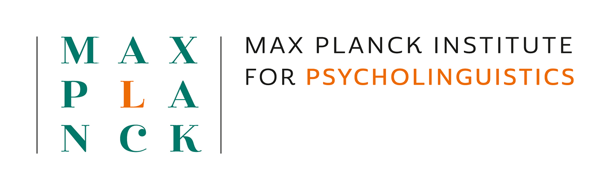

  

# Multimodal Language Department – MPI for Psycholinguistics

We study how visible bodily signals (hands, face, body posture) coordinate with speech to form multimodal language. Our work spans corpora, experimental design, computational modeling, and kinematic / gesture analysis.  
More info: [MPI Multimodal Language Department](https://www.mpi.nl/department/multimodal-language-department/23)

---

## code for Kinematic Analytics

Below are core code modules maintained by our department that support general kinematic analyses. Each repository is designed to be installable and runnable on its own.

| Module | Purpose | Repository |
|---|---|---|
| [Smoothing](https://github.com/Multimodal-Language-Department-MPI-NL/Smoothing) | Temporal filtering / smoothing of raw motion time series | `gesture-smoothing` |
| [Normalization](https://github.com/Multimodal-Language-Department-MPI-NL/Normalization) | Scaling, alignment, normalization across participants / sessions | `gesture-normalization` |
| [Merge ELAN + MediaPipe](https://github.com/Multimodal-Language-Department-MPI-NL/Merging_Motion_ELAN) | Merge synchronization of ELAN annotations with pose/face/hands data | `gesture-merge` |
| [Kinematics (Speed / Acc / Jerk)](https://github.com/Multimodal-Language-Department-MPI-NL/Speed_Acceleration_Jerk) | Compute derivatives of motion: velocity, acceleration, jerk | `gesture-kinematics` |
| [Submovements & Holds](https://github.com/Multimodal-Language-Department-MPI-NL/Submovements_Holds) | Detect movement segments, pauses, hold events | `gesture-submovements` |
| [Gesture Space & 2D Projection](https://github.com/Multimodal-Language-Department-MPI-NL/Macneillian_Space_and_2D_Size) | Dimensionality reduction / embedding of gesture trajectories | `gesture-space2d` |
| [Heatmap & Visualization](https://github.com/Multimodal-Language-Department-MPI-NL/Heatmap) | Plot heatmaps, grids, visual summaries of gesture metrics | `gesture-heatmap` |
| [Extracting MediaPipe keypoints](https://github.com/Multimodal-Language-Department-MPI-NL/MediaPipe_keypoints_extraction) | Extract MediaPipe keypoints from video data | `gesture-keypoints` |

---

## Other Department Projects & Codebases

These are research code projects by other labs or collaborators in our department. Their structure or maintenance may vary, but they often link to domain-specific methods or applications.

| Project | Description | Link / Repository |
|---|---|---|
| [Medal Workshop] | Methods for the automatic processing of multimodal interaction | [medal_workshop_on_multimodal_interaction](https://github.com/Multimodal-Language-Department-MPI-NL/medal_workshop_on_multimodal_interaction) |
| [WhisperX Tutorial] | Tutorial for transcribing speech automatically using WhisperX | [whisperx_tutorial](https://github.com/Multimodal-Language-Department-MPI-NL/whisperx_tutorial) |
| [Dynamic time warping] | Validating dynamic time warping as a measure of gesture form similarity | [dynamic time warping](https://github.com/Multimodal-Language-Department-MPI-NL/dtw_osf) |
| [Project D] | Gesture-to-semantic mapping / multimodal embeddings | (link) |
---

This repository is solely for the **organization profile**. It does **not** contain analysis code or data. For actual software and data, please navigate via the repositories listed above.

---

### How to Get Started

1. Browse the module list above and choose a repository.  
2. Clone or install that module per its README.  
3. Place your raw data in the module’s `data/raw/` directory.  
4. Run the module’s CLI to produce processed outputs and visualizations.  
5. Explore the notebooks in each module for examples and explanations.

---

### Contact & Links

- Department homepage: [mpi.nl](https://www.mpi.nl/department/multimodal-language-department/23)  
- MPI main site: [mpi.nl](https://www.mpi.nl)  

---

